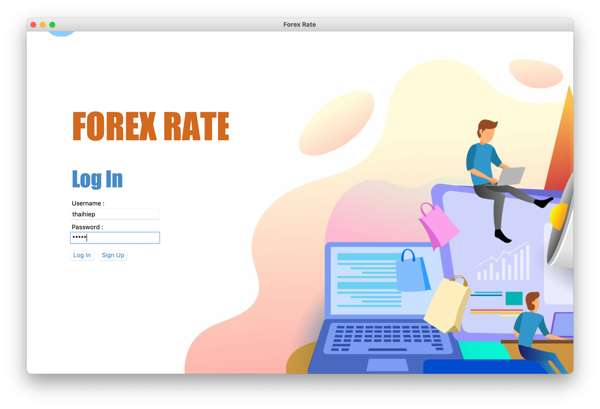
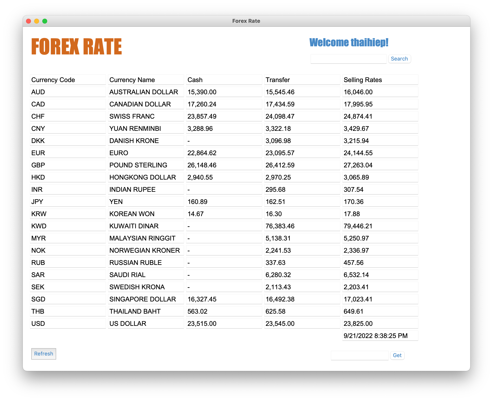
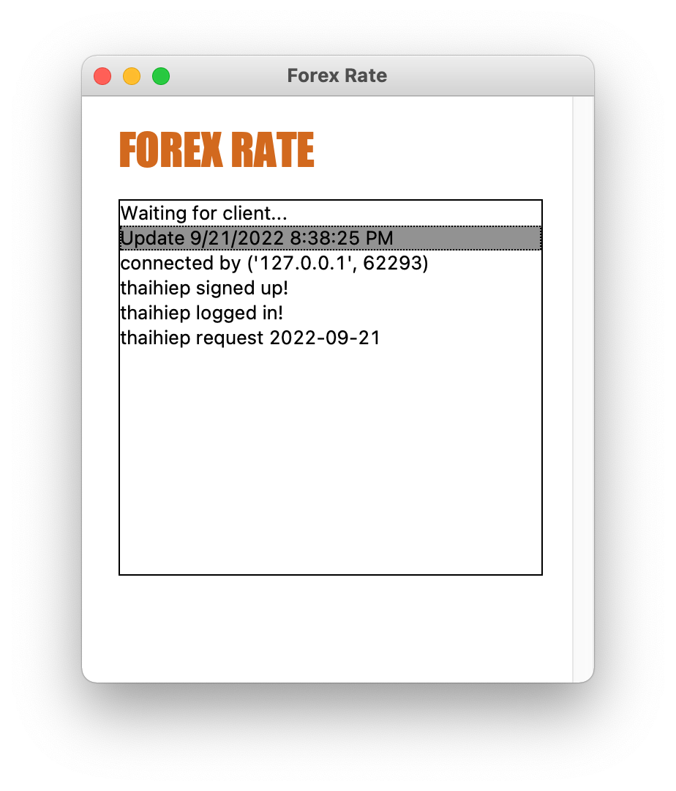

# Forex Rate Application

- Made with Python that using Tkinter Framework
- Support better for MacOS Environment
- This is the Project of **Computer Networking** Subject
- The application helps us see the detailed price statistics
- Apply client & server model
- Scores: 9.4/10 :)

# Requirements

- Install [Python](https://www.python.org/downloads/)

# Deployment

- Terminal Window 1

```
% python3 server.py
```

- Terminal Window 2

```
% python3 client.py
```

**Note:**

- Your server default runs on <mark>PORT 5454</mark>.
- Input IP: 127.0.0.1
- Input Port: 5454

# Overview

- Login Window
  
- Main Window
  
- Server Window
  

Author: Nguyễn Thái Hiệp
